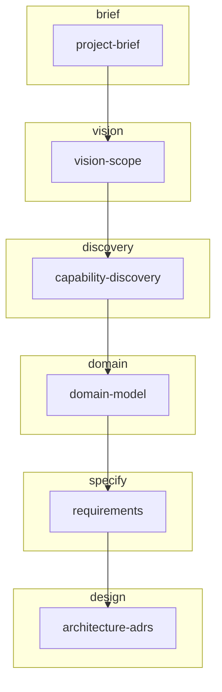

# ID2S workflow index (`_INDEX`)

Operational map for humans and agents. **Step definitions** live in the workflow file and `kit/steps/` catalog — this index tracks **runtime state** and **transitions** only.

## Configuration

- **Agent conversation language**: en
- **Documentation language**: en
- **Workflow definition**: `kit/workflows/green-field.v2.yaml` (Green-field (product + lightweight DDD))
- **Human artifacts**: `docs/id2s`
- **Agent-ready**: `agent-ready-docs/id2s`

## Workflow flow



## Runtime state (Sebastian maintains)

- **Status**: `in_progress`
- **Active step(s)**: `vision-scope`
- **Completed**: `project-brief`
- **Active stage**: `vision`

## Step sequence (reference only)

| Order | Step ID | Stage | Parallel | Profile | Assigned skill | Artifact |
|------:|---------|-------|----------|---------|----------------|----------|
| 1 | `project-brief` | `brief` | no | `coach` | `id2s-role-product-manager` | `docs/id2s/01-project-brief.md` |
| 2 | `vision-scope` | `vision` | no | `coach` | `id2s-role-product-manager` | `docs/id2s/02-vision-and-scope.md` |
| 3 | `capability-discovery` | `discovery` | no | `coach` | `id2s-role-business-analyst` | `docs/id2s/03-capability-discovery.md` |
| 4 | `domain-model` | `domain` | no | `coach` | `id2s-role-business-analyst` | `docs/id2s/04-domain-model.md` |
| 5 | `requirements` | `specify` | no | `coach` | `id2s-role-business-analyst` | `docs/id2s/05-requirements.md` |
| 6 | `architecture-adrs` | `design` | no | `coach` | `id2s-role-architect` | `docs/id2s/06-architecture-adrs.md` |

## Transitions

Advance when Sebastian confirms a step meets completion criteria defined in the workflow/step catalog. Specialists produce artifacts; Sebastian updates this index.

```yaml
# transitions (summary — full structure in agent-ready _INDEX.yaml)
- stage brief (sequential): [project-brief] when: all_steps_completed
- stage vision (sequential): [vision-scope] when: all_steps_completed
- stage discovery (sequential): [capability-discovery] when: all_steps_completed
- stage domain (sequential): [domain-model] when: all_steps_completed
- stage specify (sequential): [requirements] when: all_steps_completed
- stage design (sequential): [architecture-adrs] when: all_steps_completed
```

## Where to read step details

- Composed workflow: `kit/workflows/*.yaml` + per-step `kit/steps/<step-id>.step.yaml`
- Agent mirror: `agent-ready-docs/id2s/_INDEX.yaml` (same state and transitions)

## Global decisions (fill in)

- **Stack / runtime**:
- **Environments** (dev/stage/prod):
- **Compliance / personal data**:
- **Links** (board, designs, contracts):
